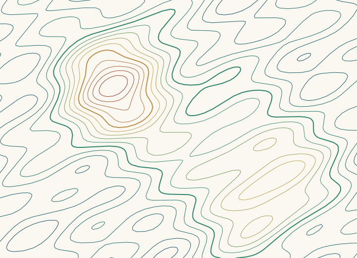

# marching-squares-contours

Turn a 2D grid of numbers (elevation, temperature, pressure, a signed distance field, a probability map) into clean contour lines. This is a from scratch, zero dependency JavaScript implementation of the **marching squares** algorithm, plus the parts most tutorials skip: resolving ambiguous saddle cells, stitching millions of tiny segments into real polylines, orienting them consistently, simplifying them, and exporting SVG.



*The image above was produced by `node bin/contour-svg.js --demo terrain --levels 14 --simplify 0.15`.*

## Why it exists

Textbook marching squares stops at "emit a line segment per cell". That output is almost useless in practice: a 500 x 500 grid gives you hundreds of thousands of disconnected two point segments, no idea which ones form a ring, no idea which side is uphill, and visual glitches where the field has a saddle. This library solves those problems:

| Problem | What this library does |
| --- | --- |
| Segments are disconnected | Crossing points are keyed by the **grid edge** they lie on, so neighbouring cells share them. Segments form a graph where every node has degree 1 or 2, and one linear pass walks it into open polylines (which always end on the border or at missing data) and closed rings. |
| Saddle cells (cases 5 and 10) are ambiguous | The cell is split according to the bilinear centre value `(tl + tr + br + bl) / 4`. This matches what the bilinear interpolant actually does and gives topologically consistent results across neighbouring cells. |
| Which side is higher? | Every contour is oriented so that values `>= level` lie on its **left** (in a y down frame). Holes therefore wind opposite to their outer shell, which is exactly what you need for filled polygons or GIS export. Orientation is decided by a vote over every segment, so one degenerate spot cannot flip it. |
| Crossing points look blocky | Points are linearly interpolated along each edge. For a linear field the result is exact. |
| Missing data | Any cell touching a `NaN` is skipped. Contours stop cleanly at the gap instead of producing garbage. |
| Too many vertices | Iterative Ramer Douglas Peucker simplification (no recursion depth limits), with a closed ring variant that splits at the farthest point so rings stay rings. |

## Quick start

Requires Node 18 or newer. There are no dependencies to install.

```bash
git clone https://github.com/MohammadHossinzehi/marching-squares-contours.git
cd marching-squares-contours
npm test                      # 22 tests, node:test, no install needed
npm run demo:svg              # writes terrain.svg
```

### Library

```js
import { isolines, contours, thresholds, sampleField, simplify, toSvgPath, signedArea } from './src/marching-squares.js';

// Sample any function onto a grid (grid[y][x]).
const grid = sampleField((x, y) => Math.hypot(x - 50, y - 50), 101, 101);

const [ring] = isolines(grid, 30);
ring.closed;                       // true
Math.abs(signedArea(ring.points)); // ~2827.4, i.e. pi * 30^2 within 0.5%

// Many levels at once, evenly spaced inside the data range.
const lines = contours(grid, thresholds(grid, 8));

// Fewer vertices, same shape.
const light = simplify(ring.points, 0.25, ring.closed);

// Straight into an SVG <path d="...">.
const d = toSvgPath({ points: light, closed: true }, { scale: 4 });
```

Each contour is `{ level, points: [[x, y], ...], closed }`. Closed rings do not repeat their first point.

| Function | Purpose |
| --- | --- |
| `isolines(grid, level, { orient = true })` | All contours at one level |
| `contours(grid, levels)` | Contours for an array of levels |
| `thresholds(grid, count)` | `count` evenly spaced levels strictly inside the data range (NaN aware) |
| `sampleField(f, width, height, bounds?)` | Build a grid from `f(x, y)` |
| `sample(grid, x, y)` | Bilinear lookup at a fractional coordinate |
| `signedArea(points)` / `contourLength(points, closed)` | Shoelace area and polyline length |
| `simplify(points, tolerance, closed)` | Ramer Douglas Peucker |
| `toSvgPath(contour, { scale, precision })` | SVG path data |

### Command line

```bash
# From a CSV or whitespace separated matrix (blank or NaN cells = missing data)
node bin/contour-svg.js elevation.csv --levels 12 --scale 4 > map.svg

# Explicit levels, from stdin
cat grid.csv | node bin/contour-svg.js --values 100,200,300 > map.svg

# Built in synthetic data: terrain or metaballs
node bin/contour-svg.js --demo metaballs --levels 8 --simplify 0.2 > blobs.svg
```

Options: `--levels N`, `--values a,b,c`, `--scale px`, `--simplify tol`, `--index N` (draw every Nth line thicker, like index contours on a topo map; 0 disables), `--demo terrain|metaballs`.

### Interactive demo

The browser demo imports the library directly as an ES module, so it just needs a static file server:

```bash
npm run serve        # or: python3 -m http.server 8000
# open http://localhost:8000/demo/
```

You get animated metaballs, a drifting terrain, and a paint mode (drag to raise the field, hold Shift to lower it). Sliders control level count, grid resolution and simplification; toggles show the sample grid and orientation arrows. The side panel reports the extraction time for every frame.

## How it works

1. **Classify.** For each cell, corners at or above the level set a bit (`tl=8, tr=4, br=2, bl=1`), giving one of 16 cases. Cases 0 and 15 produce nothing.
2. **Interpolate.** For each edge the contour crosses, the crossing point is `a + (level - a) / (b - a)` along that edge. The point is stored under a key derived from the edge (horizontal or vertical, plus its grid position) so the cell on the other side of that edge reuses exactly the same point.
3. **Resolve saddles.** Cases 5 and 10 have two valid pairings. The bilinear centre value decides whether the two high corners are connected through the middle of the cell.
4. **Stitch.** Each segment becomes an undirected edge between two crossing points. Because each grid edge belongs to at most two cells, every point has degree 1 or 2. Walking from degree 1 points gives open lines; whatever is left afterwards are cycles.
5. **Orient.** For every segment, the field is sampled a small distance to its left and right. The sum of the signs decides whether to reverse the contour.

The whole pass is O(cells) per level. On a 1000 x 1000 grid with 10 levels (about 1,700 contours and 277k vertices) extraction takes roughly 1.4 s in Node 22 on a laptop class CPU; the demo comfortably runs at 60 fps at typical canvas resolutions.

## Testing

`npm test` runs 22 tests with the built in `node:test` runner:

* **Geometry against ground truth.** A cone field contoured at radius 30 must produce one closed ring whose area and perimeter are within 0.5% of the analytic circle; every vertex must be within 0.05 of the true radius. An annulus must produce a shell and a hole, each within 1% of its analytic area and with opposite winding.
* **Exactness.** A linear field must produce a perfectly straight line at the exact level.
* **Saddles.** Both resolutions of the ambiguous 2 x 2 case are checked, plus a checkerboard for consistency across neighbouring cells.
* **Property test.** 50 random fields (seeded PRNG, so failures reproduce) check that the stitched output uses exactly as many segments as the per cell case table predicts, that every vertex lies on a grid edge and reproduces the level under bilinear sampling, and that every open line ends on the border.
* **Edge cases.** NaN gaps, levels outside the data range, malformed grids, flat grids.
* **CLI.** CSV parsing (comments, blanks, NaN), SVG output, stdin piping, bad options.
* **Performance guard.** 500 x 500 grid with 8 levels must finish well under the time limit.

## Design notes

* **Why key points by edge instead of rounding coordinates?** Hashing float coordinates for stitching is fragile: two cells can compute the same crossing with different rounding. The edge key is an integer and is exact by construction.
* **Why `>=` for classification?** Using a strict inequality on one side and a non strict one on the other guarantees every edge is either crossed or not, with no double counting when a sample equals the level exactly.
* **Why vote for orientation?** Sampling at a single point can land on a flat region or a spot where the interpolant is tangent to the level. Summing over every segment is cheap and robust.
* **Not included (yet):** filled isobands (the 81 case ternary variant) and marching cubes for 3D. Both would reuse the same edge keyed stitching approach.

## License

MIT
